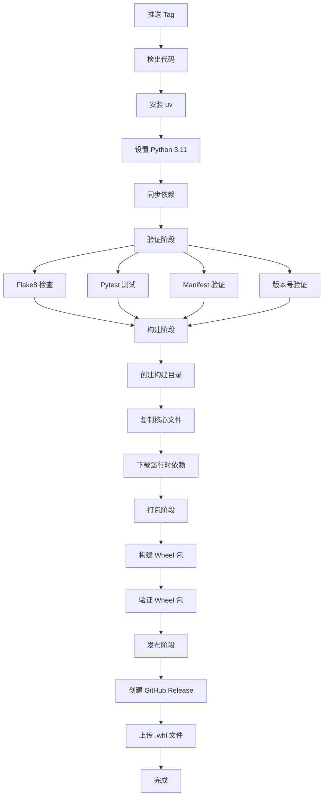

# 项目架构文档

## 设计理念

本项目参考了 [Obsidian Sample Plugin](https://github.com/obsidianmd/obsidian-sample-plugin) 的最佳实践，是一个经过多年实践验证的模板架构。

### 核心设计原则

1. **约定优于配置** - 统一的文件结构和命名规范
2. **自动化优先** - 最小化手动操作，最大化自动化
3. **标准化** - 遵循 Python 生态的最佳实践（PEP 621, PEP 517）
4. **开发者友好** - 清晰的文档和丰富的示例

## 技术选型

### 包管理: uv

选择 [uv](https://github.com/astral-sh/uv) 而非传统的 pip + virtualenv：

**优势：**
- ⚡ **速度快**: 比 pip 快 10-100 倍
- 🔒 **可靠性**: 更好的依赖解析
- 📦 **现代化**: 支持 PEP 621 标准
- 🎯 **一致性**: 自动管理虚拟环境

### 构建系统: Hatchling

使用 [Hatchling](https://github.com/pypa/hatch) 作为构建后端：

**优势：**
- ✅ 符合 PEP 517/518 标准
- 📁 灵活的文件包含规则
- 🚀 快速构建
- 🔧 可扩展的插件系统

### 测试框架: Pytest

选择 pytest 而非 unittest：

**优势：**
- 💡 简洁的语法
- 🔍 详细的错误报告
- 🧩 丰富的插件生态
- ⚡ 快速执行

## 项目结构说明

```
prefab-template/
│
├── .github/                      # GitHub 配置
│   ├── workflows/
│   │   └── build-and-release.yml # CI/CD 主流程
│   ├── ISSUE_TEMPLATE/           # Issue 模板
│   └── PULL_REQUEST_TEMPLATE.md  # PR 模板
│
├── src/                          # 源代码（核心）
│   ├── __init__.py              # 模块导出
│   ├── main.py                  # 主入口（必须）
│   └── utils/                   # 工具模块示例
│       ├── __init__.py
│       └── math_utils.py        # 数学工具
│
├── tests/                        # 测试代码
│   ├── test_main.py             # 主函数测试
│   └── test_utils.py            # 工具函数测试
│
├── scripts/                      # 辅助脚本
│   ├── validate_manifest.py     # Manifest 验证
│   ├── version_bump.py          # 版本号升级
│   └── quick_start.py           # 快速验证
│
├── prefab-manifest.json          # 函数元数据（核心）
├── pyproject.toml               # 项目配置
├── .editorconfig                # 编辑器配置
├── .flake8                      # Linter 配置
├── .gitignore                   # Git 忽略规则
│
├── README.md                    # 主文档
├── QUICK_REFERENCE.md           # 快速参考
├── CONTRIBUTING.md              # 贡献指南
├── AGENTS.md                    # AI 助手指南
├── ARCHITECTURE.md              # 本文件（架构设计）
├── DOCS_INDEX.md                # 文档导航
├── CHANGELOG.md                 # 更新日志
├── LICENSE                      # MIT 许可证
└── prd.md                       # 产品需求文档
```

## 核心文件详解

### 1. `prefab-manifest.json`

**作用**: AI 理解和调用预制件的"API 契约"

**关键字段：**
```json
{
  "schema_version": "1.0",        // 清单版本
  "id": "预制件唯一标识",
  "version": "语义化版本号",
  "entry_point": "src/main.py",  // 固定入口
  "dependencies_file": "pyproject.toml",
  "functions": [...]              // 函数列表
}
```

**设计考虑：**
- 必须与 `src/main.py` 保持严格一致
- 使用 `scripts/validate_manifest.py` 自动验证
- 版本号必须与 Git Tag 一致

### 2. `src/main.py`

**作用**: 预制件的唯一入口点

**设计规范：**
```python
# ✅ 正确示例
from .utils import helper_function

def exposed_function(param: str) -> dict:
    """必须有完整的文档字符串"""
    result = helper_function(param)
    return {"success": True, "result": result}

# ❌ 错误示例
def _private_function():  # 私有函数不应导出
    pass
```

### 3. `pyproject.toml`

**作用**: 项目配置和依赖管理

**关键配置：**
```toml
[project]
dependencies = []  # 运行时依赖（会被打包）

[project.optional-dependencies]
dev = [...]  # 开发依赖（不会被打包）

[tool.hatch.build.targets.wheel]
packages = ["src"]  # 指定要打包的目录
```

## CI/CD 流程

### 触发条件
- 推送格式为 `v*.*.*` 的 Git Tag

### 执行阶段



**v2 版本变更：**
- 打包格式从 `.tar.gz` 改为标准 Python Wheel (`.whl`)
- 版本验证包括 `pyproject.toml`、`prefab-manifest.json` 和 Git Tag 三方一致性
- 类型系统升级到 v2.2，支持 `InputFile` 和 `OutputFile`

### 验证机制

**三重验证保障：**

1. **代码质量**: Flake8 静态检查
2. **功能正确性**: Pytest 单元测试  
3. **接口一致性**: Manifest 验证脚本

任何一项失败，整个流程中断。

## 依赖管理策略

### 运行时依赖

```toml
[project]
dependencies = [
    "requests>=2.31.0",  # 锁定最小版本
]
```

**特点：**
- 会被打包到 `build/vendor/` 目录
- 随预制件一起分发
- 不依赖用户环境

### 开发依赖

```toml
[project.optional-dependencies]
dev = [
    "pytest>=7.4.0",
    "flake8>=6.1.0",
]
```

**特点：**
- 仅用于开发和测试
- 不会被打包
- 使用 `uv sync --dev` 安装

## 版本管理

### 语义化版本

遵循 [Semantic Versioning 2.0.0](https://semver.org/):

```
主版本.次版本.修订号
  |      |      |
  |      |      └─ PATCH: 向后兼容的问题修复
  |      └──────── MINOR: 向后兼容的功能新增
  └─────────────── MAJOR: 不兼容的 API 更改
```

### 自动化版本升级

```bash
# 使用脚本自动更新多个文件
uv run python scripts/version_bump.py patch

# 自动更新：
# - prefab-manifest.json
# - pyproject.toml
```

## 测试策略

### 测试分类

1. **单元测试**: 测试单个函数的逻辑
2. **集成测试**: 测试多个模块的协作
3. **边界测试**: 测试极端情况和边界值

### 测试覆盖

```bash
# 运行测试并生成覆盖率报告
uv run pytest tests/ -v --cov=src --cov-report=html

# 目标: 保持 >80% 的代码覆盖率
```

### 测试示例

```python
class TestMyFunction:
    def test_normal_case(self):
        """测试正常情况"""
        assert my_function("input") == expected
    
    def test_edge_case(self):
        """测试边界情况"""
        assert my_function("") == {"success": False}
    
    def test_error_handling(self):
        """测试错误处理"""
        with pytest.raises(ValueError):
            my_function(None)
```

## 配置文件说明

### `.editorconfig`

统一不同编辑器的代码风格：
- 缩进方式（空格/制表符）
- 缩进大小
- 行尾字符
- 文件编码

### `.flake8`

Python 代码风格检查：
- 最大行长度: 120
- 排除目录: `__pycache__`, `build`, `.venv`
- 忽略规则: E203, W503
- 最大复杂度: 10

### `pyproject.toml`

现代 Python 项目的统一配置文件：
- 项目元数据 (PEP 621)
- 构建配置 (PEP 517)
- 工具配置 (pytest, coverage)

## 最佳实践

### 1. 代码组织

```python
# 推荐的模块结构
src/
├── main.py           # 主入口，暴露给 AI 的函数
├── utils/           # 工具函数
│   ├── validators.py  # 验证相关
│   ├── formatters.py  # 格式化相关
│   └── helpers.py     # 辅助函数
└── models.py        # 数据模型（如需要）
```

### 2. 错误处理

```python
def my_function(input_data: str) -> dict:
    """始终返回结构化的响应"""
    try:
        # 验证输入
        if not input_data:
            return {
                "success": False,
                "error": "输入不能为空"
            }
        
        # 执行逻辑
        result = process(input_data)
        
        return {
            "success": True,
            "result": result
        }
    except Exception as e:
        return {
            "success": False,
            "error": str(e)
        }
```

### 3. 文档编写

```python
def function_name(param1: str, param2: int = 0) -> dict:
    """
    一句话描述函数的作用
    
    详细说明函数的功能、使用场景和注意事项。
    
    Args:
        param1: 参数1的说明，包括类型、格式、范围等
        param2: 参数2的说明，可选参数要说明默认值
    
    Returns:
        返回值的结构说明：
        {
            "success": bool,  # 是否成功
            "result": any,    # 结果数据
            "error": str      # 错误信息（失败时）
        }
    
    Raises:
        ValueError: 什么情况下会抛出此异常
    
    Example:
        >>> result = function_name("test", 10)
        >>> print(result["success"])
        True
    """
    pass
```

## 扩展指南

### 添加新的工具模块

1. 在 `src/` 下创建新模块
2. 在 `src/__init__.py` 中导出（如需要）
3. 编写对应的测试文件
4. 更新文档

### 添加新的验证规则

1. 编辑 `scripts/validate_manifest.py`
2. 添加新的验证函数
3. 在 `validate_functions()` 中调用
4. 更新错误提示信息

### 自定义 CI/CD 流程

1. 编辑 `.github/workflows/build-and-release.yml`
2. 添加新的步骤或作业
3. 本地测试（使用 [act](https://github.com/nektos/act)）
4. 推送并观察 Actions 日志

## 参考资源

### 外部参考
- [Obsidian Sample Plugin](https://github.com/obsidianmd/obsidian-sample-plugin) - 本项目的灵感来源
- [uv Documentation](https://github.com/astral-sh/uv) - uv 包管理器文档
- [PEP 621](https://peps.python.org/pep-0621/) - Python 项目元数据标准
- [Semantic Versioning](https://semver.org/) - 语义化版本规范

### 内部文档
- [README.md](README.md) - 用户使用指南
- [CONTRIBUTING.md](CONTRIBUTING.md) - 贡献者指南
- [AGENTS.md](AGENTS.md) - AI 助手开发指南
- [DOCS_INDEX.md](DOCS_INDEX.md) - 文档导航索引
- [prd.md](prd.md) - 产品需求文档

---

**维护者**: 请在对架构进行重大更改时更新此文档。

